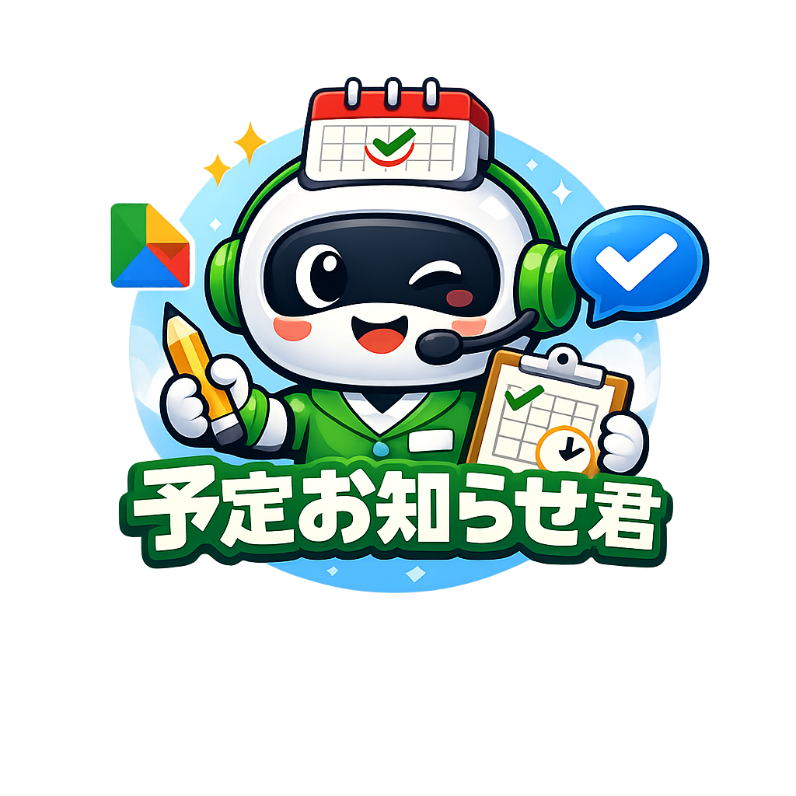
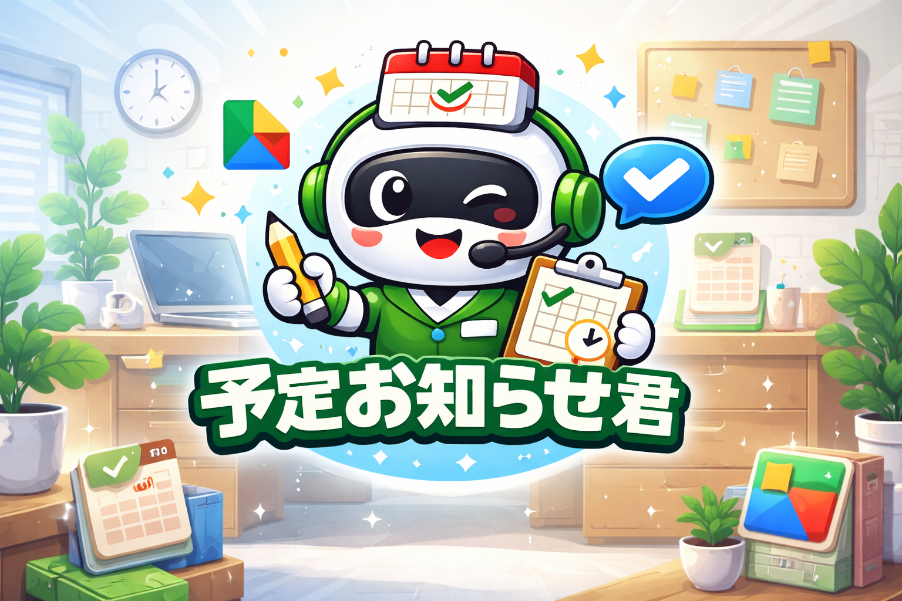

# 予定お知らせ君



Googleカレンダーと連携して、予定を LINE で対話的に登録・通知してくれる Google Apps Script (GAS) 製の LINE ボットです。LINE で友だち追加すると **「予定お知らせ君」** という名前で登場します（リポジトリ上のコード名は `daybell`）。

## 主な機能

- **対話型タスク登録** — LINE にメッセージを送ると、開始時間 → 終了時間 → 目標フラグの順に GUI で聞いてきて、Googleカレンダーに登録します
- **目標カウントダウン** — 「目標設定」と送ると直近の予定から目標を選択でき、毎朝「○○まであと何日」と通知
- **朝の通知** — 毎朝7時に、天気予報（気象庁API） + 期限が迫っているタスク + 1週間後の予定をまとめて配信
- **夜の通知** — 毎晩20時に、翌日の予定を配信（ごみ出し等の繰り返し予定も通常の予定として表示される）

## 画面イメージ



## 技術スタック

- Google Apps Script (GAS)
- LINE Messaging API
- Google Calendar API (CalendarApp)
- 気象庁 天気予報 API

---

## セットアップ手順

自分の環境にこのボットをデプロイする手順です。

### 前提条件

- Google アカウント
- LINE アカウント
- LINE Developers アカウント（無料）

### 1. LINE Messaging API チャネルを作成

1. [LINE Developers Console](https://developers.line.biz/console/) にログイン
2. プロバイダーを作成（既存のものを使ってもOK）
3. 「Messaging API」チャネルを新規作成
4. 以下をメモしておく:
   - **チャネルアクセストークン（長期）** — 「Messaging API設定」タブの下部で発行
   - **あなた自身のユーザーID** — 「チャネル基本設定」タブ内に記載の `U` から始まるID
5. 「応答メッセージ」「あいさつメッセージ」を無効化、「Webhook の利用」を有効化

### 2. Google Apps Script プロジェクトを作成

1. [Google Apps Script](https://script.google.com/) を開き、「新しいプロジェクト」
2. 初期の `コード.gs` の中身をすべて削除
3. このリポジトリの [`src/main.gs`](src/main.gs) の内容をコピー＆ペースト
4. ファイル冒頭の2行を自分の値に書き換え:

```javascript
const LINE_ACCESS_TOKEN = 'ここにアクセストークンを貼り付けます';
const LINE_USER_ID = 'ここにユーザーIDを貼り付けます';
```

5. プロジェクト名を好きな名前に（例: `予定お知らせ君`）

### 3. Webアプリとしてデプロイ

1. GAS 画面右上の「デプロイ」→「新しいデプロイ」
2. 種類:「ウェブアプリ」
3. 設定:
   - 次のユーザーとして実行: **自分**
   - アクセスできるユーザー: **全員**
4. 「デプロイ」を押し、権限を承認
5. 発行された **ウェブアプリURL** をコピー

### 4. LINE 側に Webhook URL を登録

1. LINE Developers Console → 作成したチャネル → 「Messaging API設定」タブ
2. 「Webhook URL」に 3 でコピーした URL を貼り付け → 「更新」
3. 「検証」ボタンで成功することを確認
4. 「Webhook の利用」を ON にする

### 5. 友だち追加

同じく「Messaging API設定」タブにある QR コードを自分のスマホで読み取り、ボットを友だち追加。

### 6. 時間トリガーを設定

朝夜の自動通知を有効化するため、GAS で一度だけトリガー設定関数を走らせます。

1. GAS エディタで関数一覧から `setTriggers` を選択
2. 「実行」ボタンを押す（初回は権限承認）
3. 「トリガー」メニューで `notifyMorning` と `notifyNight` が登録されていることを確認

これでセットアップ完了です。

---

## 使い方

| ユーザー操作 | ボットの動き |
|---|---|
| 任意のメッセージを送る（例:「買い物」） | タスク名として扱い、開始時間 → 終了時間 → 目標フラグを対話式で聞いてカレンダーに登録 |
| `目標設定` と送る（リッチメニュー上段） | 直近半年のカレンダー予定から目標を選択するメニューを表示 |
| `予定確認` と送る（リッチメニュー下段） | 今日から7日間の予定を日付ごとにまとめて表示 |
| 何もしない（毎朝7時） | 天気 + 目標カウントダウン + 今日のタスク + 1週間後の予定を自動配信 |
| 何もしない（毎晩20時） | 翌日の予定を自動配信 |

### カレンダーの命名ルール

| タイトルの接頭辞 | 意味 |
|---|---|
| `【目標】○○` | 朝通知でカウントダウン表示される |
| `【タスク】○○` | 期限3日前から朝通知に出る |
| その他（接頭辞なし） | 通常の予定。夜通知の「明日の予定」や予定確認に表示される |

---

## カスタマイズ

### 天気予報のエリアを変える

`getWeatherForecast()` 内の URL を自分の地域コードに書き換えてください。

```javascript
UrlFetchApp.fetch('https://www.jma.go.jp/bosai/forecast/data/forecast/130000.json')
```

`130000` が東京のコードです。他の地域は [気象庁の予報区コード一覧](https://www.jma.go.jp/bosai/common/const/area.json) を参照。表示文言 `【東京の天気予報】` も同関数内で変更できます。

### 通知時間を変える

`setTriggers()` 内の `.atHour(7)` と `.atHour(20)` を書き換えて、再度 `setTriggers` を実行してください。既存トリガーは自動で削除されます。

### 使うカレンダーを変える

デフォルトカレンダー以外を使いたい場合は、`CalendarApp.getDefaultCalendar()` を `CalendarApp.getCalendarById('xxxxx@group.calendar.google.com')` に置き換えてください。

---

## 注意事項

- `LINE_ACCESS_TOKEN` と `LINE_USER_ID` は**絶対に公開リポジトリにコミットしないでください**。このリポジトリではプレースホルダのままです
- GAS の無料枠には 1 日あたりの実行回数・時間制限があります。個人利用の範囲であれば通常問題ありません
- LINE Messaging API のフリープランは月 200 通までの push 通知に制限されています（reply は無制限）。朝夜の通知は push なので、1人で使う分には余裕がありますが、家族等で共有する際は注意

## ライセンス

[MIT License](LICENSE)
